# Project UAS Pengolahan Citra Digital

## Bukti Gambar

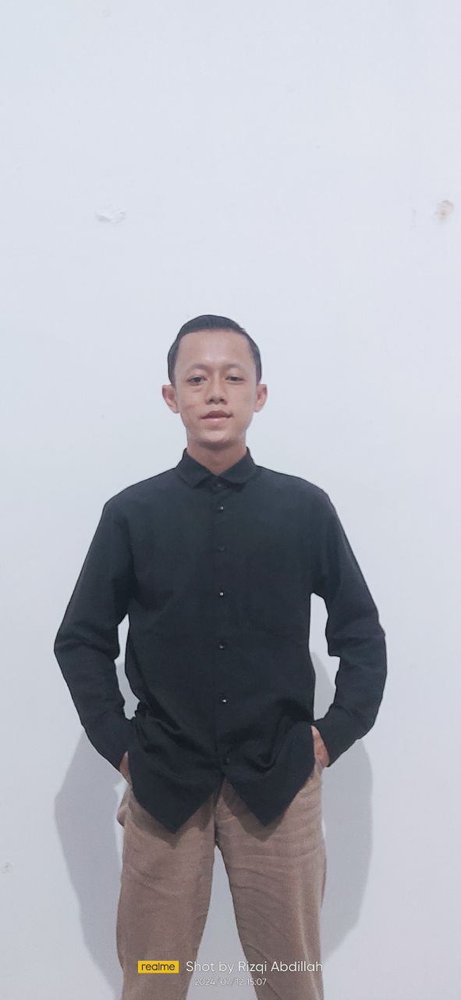
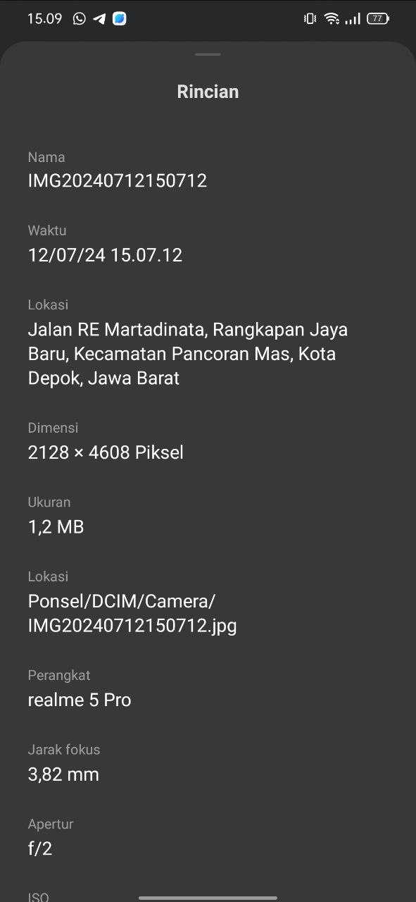

## Teori Yang Mendukung
## * Filter Mean

Filter mean adalah salah satu jenis filter spasial yang paling sederhana dalam pengolahan citra. Prinsipnya adalah mengambil rata-rata dari nilai-nilai piksel di sekitar titik yang sedang diproses. Prosesnya melibatkan :

1. Konvolusi : Filter mean melibatkan operasi konvolusi antara citra asli dan kernel (matriks berukuran kecil yang berisi koefisien bobot). Kernel untuk filter mean biasanya berisi nilai konstan yang sama (misalnya, 1/9 untuk filter 3x3 pada citra grayscale).

2. Penggunaan : Filter mean digunakan untuk menghaluskan citra dengan mengurangi variasi kecil dalam intensitas warna di sekitar setiap piksel. Ini membantu mempertahankan detail penting sambil mengurangi noise yang halus seperti Gaussian noise.

## * Filter Median
Filter median adalah metode yang lebih kompleks daripada filter mean karena tidak hanya menggunakan rata-rata, tetapi menggunakan nilai median dari nilai-nilai piksel di sekitar titik yang sedang diproses. Langkah-langkahnya termasuk:

1. Sortir dan Pemilihan Median : Piksel di sekitar titik target diurutkan dan nilai median (nilai tengah) dipilih sebagai nilai untuk titik tersebut dalam citra output. Teknik ini lebih tahan terhadap noise impulsif (salt-and-pepper noise) atau gangguan yang menyebabkan nilai ekstrem di sekitar titik tersebut.

2. Penggunaan : Filter median sangat berguna untuk menghilangkan jenis noise yang disebabkan oleh gangguan ekstrem atau noise yang terjadi secara sporadis dalam citra.

## * Filtering Citra

Filtering citra adalah proses menggunakan filter atau kernel untuk memodifikasi citra input. Tujuannya bisa untuk mengurangi noise, mempertajam detail, atau memisahkan objek dari latar belakang. Beberapa teknik umum termasuk filter mean (rata-rata), filter median, deteksi tepi, dan segmentasi. Implementasi melibatkan konvolusi antara citra dan kernel untuk menghasilkan citra output yang telah diubah sesuai dengan karakteristik filter yang digunakan.

## Rincian/Tahapan cara menyelesaikan

### 1. Mengimpor Pustaka

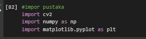

- cv2 : OpenCV library yang digunakan untuk pemrosesan citra.
- numpy : Library untuk operasi numerik.
- matplotlib.pyplot : Library untuk visualisasi citra.

### 2. Baca Gambar

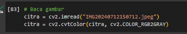

- cv2.imread("IMG20240712150712.jpeg") : Membaca file gambar dan menyimpannya dalam variabel citra.
- cv2.cvtColor(citra, cv2.COLOR_BGR2GRAY) : Mengonversi gambar berwarna (BGR) menjadi gambar dalam format grayscale.

### 3. Menyalin citra ke variabel khusus dan melihat atribut berupa jumlah baris dan kolom 

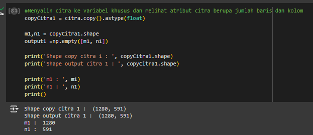

- citra.copy() : Membuat salinan dari objek citra. Ini penting untuk memastikan bahwa perubahan yang dilakukan pada copyCitra1 tidak mempengaruhi citra asli.
- .astype(float) : Mengubah tipe data elemen-elemen dalam citra salinan menjadi float. Hal ini berguna jika kita membutuhkan presisi lebih tinggi dalam pemrosesan citra.
- copyCitra1.shape : Mengembalikan tuple yang berisi dimensi dari copyCitra1. Biasanya, untuk citra dua dimensi, tuple ini berisi (jumlah baris, jumlah kolom).
- m1, n1 : Variabel m1 diisi dengan jumlah baris, dan n1 diisi dengan jumlah kolom dari copyCitra1.
- np.empty([m1, n1]) : Membuat array kosong dengan bentuk (shape) yang sama dengan copyCitra1. np.empty mengalokasikan memori tanpa menginisialisasi nilai elemen-elemennya, sehingga lebih cepat daripada np.zeros, tetapi elemen-elemennya mungkin mengandung nilai acak. Array ini dinamakan output1 dan akan digunakan untuk menyimpan hasil pemrosesan lebih lanjut.
- print('Shape copy citra 1 : ', copyCitra1.shape) : Mencetak ukuran (shape) dari copyCitra1 untuk memastikan salinan citra telah dibuat dengan benar.
- print('Shape output citra 1 : ', copyCitra1.shape) : Mencetak ukuran (shape) dari output1. Karena output1 dibuat dengan ukuran yang sama dengan copyCitra1, seharusnya output ini sama.
- print('m1 : ', m1) : Mencetak jumlah baris dari copyCitra1 yang disimpan dalam variabel m1.
- print('n1 : ', n1) : Mencetak jumlah kolom dari copyCitra1 yang disimpan dalam variabel n1.
- print() : Mencetak baris kosong untuk kejelasan tampilan output di konsol.

### 4. Membuat Filter

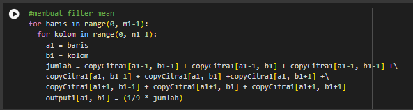

- Iterasi Baris dan Kolom : Kode ini menggunakan dua loop for untuk mengiterasi melalui semua baris dan kolom dalam copyCitra1.
- Penjumlahan Nilai Sekitar : Setiap elemen (a1, b1) dalam copyCitra1 dijumlahkan dengan nilai-nilai tetangganya (atas kiri, atas tengah, atas kanan, kiri, tengah, kanan, bawah kiri, bawah tengah, bawah kanan). Ini dilakukan dengan memastikan bahwa indeks yang digunakan valid dan tidak keluar dari batas citra.
- Perhitungan Rata-rata : Nilai rata-rata dari semua nilai yang dijumlahkan dihitung dengan mengalikan jumlah dengan 1/9 dan menetapkannya ke output1[a1, b1]

### 5. Menampilkan input citra 1 dan output citra 1

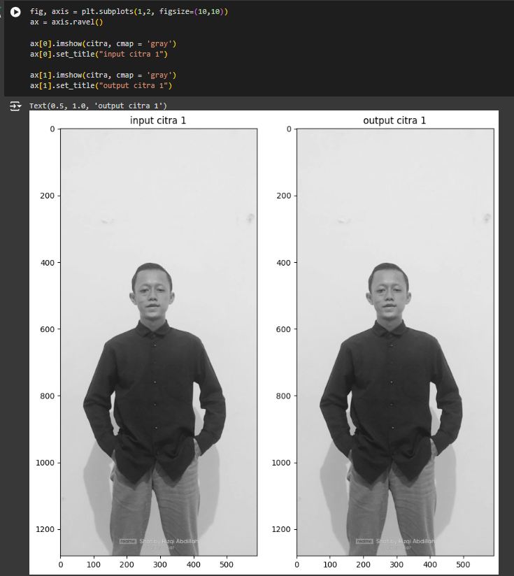
- plt.subplots(1, 2, figsize=(10, 10)) : Membuat figure (fig) dan array dari dua axes (axis) yang akan digunakan untuk subplot. 1, 2 mengatur jumlah baris dan kolom subplot. figsize=(10, 10) menentukan ukuran gambar.
- ax = axis.ravel() : Mengubah array axis menjadi satu dimensi menggunakan ravel(), sehingga ax[0] dan ax[1] dapat digunakan untuk mengakses subplot pertama dan kedua.
-ax[0].imshow(citra, cmap='gray') : Menampilkan citra citra pada subplot pertama (ax[0]) dengan colormap 'gray'.
- ax[0].set_title("Input Citra 1") : Memberikan judul untuk subplot pertama.
- ax[1].imshow(citra, cmap='gray') : Menampilkan citra citra pada subplot kedua (ax[1]) dengan colormap 'gray'.
- ax[1].set_title("Output Citra 1") : Memberikan judul untuk subplot kedua.
- Menampilkan plot yang telah dibuat menggunakan plt.show().

### 6. Membuat filter median

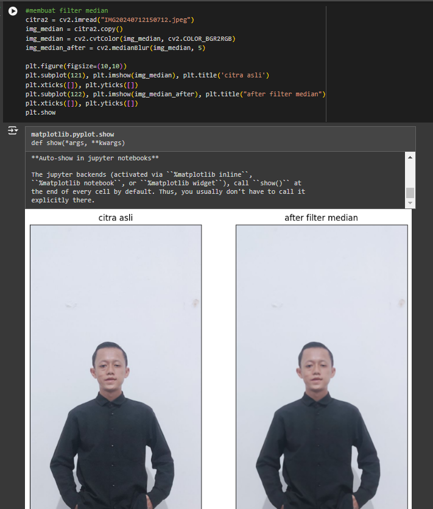

- img_median = citra2.copy() : Membuat salinan dari gambar asli dan menyimpannya dalam variabel img_median.
- img_median = cv2.cvtColor(img_median, cv2.COLOR_BGR2RGB) : Mengubah ruang warna gambar dari BGR (yang digunakan oleh OpenCV) ke RGB (yang digunakan oleh matplotlib).
img_median_after = cv2.medianBlur(img_median, 5) : Menerapkan filter median pada gambar dengan ukuran kernel 5 dan menyimpan hasilnya dalam variabel img_median_after.
- plt.figure(figsize=(10,10)) : Mengatur ukuran plot menjadi 10x10 inci.
- plt.subplot(121), plt.imshow(img_median), plt.title('citra asli') : Menampilkan gambar asli pada subplot pertama (121) dan memberikan judul "citra asli".
- plt.xticks([]), plt.yticks([]) : Menghilangkan tanda pada sumbu x dan y untuk subplot pertama.
- plt.subplot(122), plt.imshow(img_median_after), plt.title("after filter median") : Menampilkan gambar setelah filter median pada subplot kedua (122) dan memberikan judul "after filter median".
- plt.xticks([]), plt.yticks([]) : Menghilangkan tanda pada sumbu x dan y untuk subplot kedua.
plt.show(): Menampilkan plot.

### 7. 

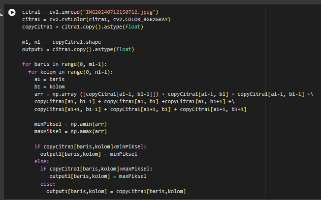

- citra1 = cv2.imread("IMG20240712150712.jpeg") : Membaca gambar dari file dengan nama "IMG20240712150712.jpeg" dan menyimpannya dalam variabel citra1.
- citra1 = cv2.cvtColor(citra1, cv2.COLOR_RGB2GRAY) : Mengubah ruang warna gambar dari RGB ke grayscale.
- copyCitra1 = citra1.copy().astype(float) : Membuat salinan dari gambar asli dan mengubah tipe datanya menjadi float untuk keperluan perhitungan.
- m1, n1 = copyCitra1.shape : Mendapatkan ukuran gambar (jumlah baris m1 dan kolom n1).
- output1 = citra1.copy().astype(float) : Membuat salinan dari gambar asli untuk output dan mengubah tipe datanya menjadi float.
- 8-9. for baris in range(0, m1-1) : dan for kolom in range(0, n1-1):: Loop untuk setiap baris dan kolom gambar, kecuali baris dan kolom terakhir.
- a1 = baris dan b1 = kolom : Mendefinisikan posisi piksel saat ini.
- 11-13. arr = np.array([ ... ]) : Membuat array dari piksel tetangga dan piksel saat ini.
- minPiksel = np.amin(arr) : Mencari nilai minimum dari array.
- maxPiksel = np.amax(arr) : Mencari nilai maksimum dari array.
- 16-22. if ... elif ... else ... : Mengatur nilai piksel output berdasarkan nilai minimum dan maksimum dari tetangga.

### 8. Menampilkan Original Image dan mean filtered image

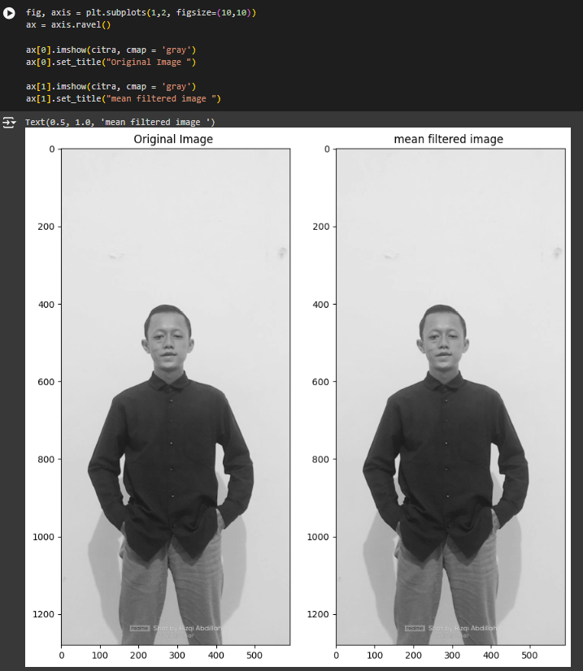

- fig, axis = plt.subplots(1, 2, figsize=(10, 10)) : Membuat subplot dengan 1 baris dan 2 kolom, serta mengatur ukuran plot menjadi 10x10 inci.
- ax = axis.ravel() : Mengubah array axis menjadi array satu dimensi untuk memudahkan akses ke subplot.
- ax[0].imshow(citra, cmap='gray') : Menampilkan gambar asli pada subplot pertama, dengan colormap grayscale.
ax[0].set_title("Original Image") : Memberikan judul "Original Image" pada subplot pertama.
- ax[1].imshow(citra, cmap='gray') : Menampilkan gambar yang telah difilter pada subplot kedua, dengan colormap grayscale.
- ax[1].set_title("Mean Filtered Image") : Memberikan judul "Mean Filtered Image" pada subplot kedua.
- plt.show() : Menampilkan plot.

### 9. Menampilkan Citra asli, After filter median, Original Image dan mean filtered image

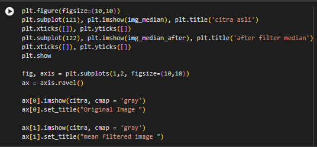

- plt.figure(figsize=(10,10)) : Mengatur ukuran plot menjadi 10x10 inci.
- plt.subplot(121), plt.imshow(img_median), plt.title('citra asli') : Menampilkan gambar asli pada subplot pertama dengan indeks 121, dan memberikan judul "citra asli".
- plt.xticks([]), plt.yticks([]) : Menghilangkan tanda pada sumbu x dan y untuk subplot pertama.
- plt.subplot(122), plt.imshow(img_median_after), plt.title('after filter median') : Menampilkan gambar setelah filter median pada subplot kedua dengan indeks 122, dan memberikan judul "after filter median".
- plt.xticks([]), plt.yticks([]) : Menghilangkan tanda pada sumbu x dan y untuk subplot kedua.
- plt.show() : Menampilkan plot.

- fig, axis = plt.subplots(1, 2, figsize=(10, 10)) : Membuat subplot dengan 1 baris dan 2 kolom, serta mengatur ukuran plot menjadi 10x10 inci.
- ax = axis.ravel() : Mengubah array axis menjadi array satu dimensi untuk memudahkan akses ke subplot.
- ax[0].imshow(citra1, cmap='gray') : Menampilkan gambar asli pada subplot pertama dengan colormap grayscale.
- ax[0].set_title("Original Image") : Memberikan judul "Original Image" pada subplot pertama.
- ax[1].imshow(output1, cmap='gray') : Menampilkan gambar hasil filter median pada subplot kedua dengan colormap grayscale.
- ax[1].set_title("Mean Filtered Image") : Memberikan judul "Mean Filtered Image" pada subplot kedua.
- plt.show() : Menampilkan plot.
